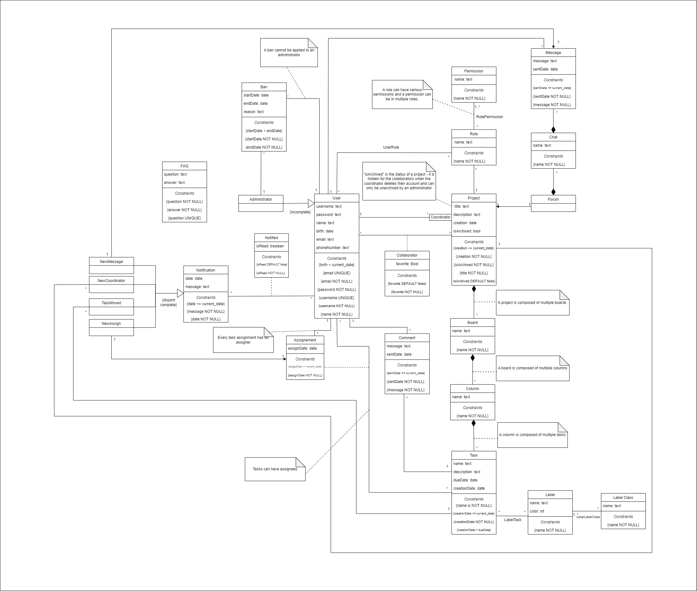

# EBD: Database Specification Component

## A4: Conceptual Data Model

This artifact objective is to illustrate the entities and relations between them that are relevant in our project context. 

For that, UML was used since it's common among the field and it's easy to understand.
This conceptual model will be used as a support to design the system's database.

### 1. Class diagram

### 2. Additional Business Rules

* BR01. When a project is deleted, all its boards are deleted as well.
* BR02. When a board is deleted, all its verticals are deleted as well.
* BR03. When a vertical is deleted, all its tasks are deleted as well.
* BR04. When a forum is deleted, all its chats are deleted as well.
* BR05. When a chat is deleted, all its messages are deleted as well.
* BR06. When a task is deleted its chat is deleted too.
  
## A5: Relational Schema, validation and schema refinement

This artifact contains the Relational Schema obtained by mapping from the Conceptual Data Model. The Relational Schema includes each relation schema, attributes, domains, primary keys, foreign keys and other integrity rules: UNIQUE (UK), DEFAULT (DF), NOT NULL (NN), CHECK (CK). A Schema Validation section was added to verify the normal form of each table. An Annex containing the SQL code to create de schema.

### Relational Schema

| Relation reference | Relation Compact Notation                                                                                                                                        |
| ------------------ | ---------------------------------------------------------------------------------------------------------------------------------------------------------------- |
| R01                | user(id, username UK NN, password NN, name NN, birth NN CK birth < Today, email UK NN, phone\_number)                                                            |
| R02                | project(id, title NN, description, creation NN CK creation <= Today, is\_archived NN DF false, id\_coordinator->user NN)                                         |
| R03                | board(id, name NN, id\_project->project NN)                                                                                                                      |
| R04                | vertical(id, name NN, isDone NN DF false, id\_board->board NN)                                                                                                                         |
| R05                | task(id, name NN, description, creation\_date NN CK creation\_date <= Today ,due\_date CK creation\_date < due\_date, id\_vertical->vertical NN) |
| R06                | label(id, name NN, 1<= color NN <=16777215)                                                                                                                                               |
| R07                | label\_class(id, name NN)                                                                                                                                        |
| R08                | forum(id\_project\->project)                                                                                                                                     |
| R09                | chat(id, name NN)                                                                                                                                                |
| R10                | message(id, message NN, sent\_date NN CK sent\_date <= Today, id\_user->user NN, id\_chat->chat NN)                                                              |
| R11                | role(id, name NN, id\_project->project NN)                                                                                                                       |
| R12                | permission(id, name NN)                                                                                                                                          |
| R13                | administrator(id, id\_user->user NN)                                                                                                                             |
| R14                | ban(id, start\_date NN, end\_date NN CK start\_date < end\_date, reason, id\_user->user NN, id\_administrator->administrator NN)                                 |
| R15                | faq(id, question NN UK, answer NN)                                                                                                                               |
| R16                | notification(id, date NN CK date <= Today, message NN)                                                                                                           |
| R17                | comment(id, message NN, sent\_date NN CK sent\_date <= Today, id\_task->task, id\_user->user)                                                                                |
| R18                | new\_message(id\_notification\->notification, id\_message->message)                                                                                              |
| R19                | new\_coordinator(id\_notification\->notification, id\_project->project)                                                                                          |
| R20                | new\_assign(id\_notification\->notification, \{id\_task, id\_user\}->assignment)                                                                                        |
| R21                | task\_moved(id\_notification\->notification id\_task->task)                                                                                                      |
| R22                | assignment(id\_user\->user, id\_task\->task, assign\_date NN CK assignDate <= current\_date)                                                                     |
| R23                | notified(id\_user\->user, id\_notification\->notification, isRead NN DF false)                                                                                   |
| R24                | user\_role(id\_user\->user, id\_role\->role)                                                                                                                     |
| R25                | collaborator(id\_user\->user, id\_project\->project, favorite NN DF false)                                                                                       |
| R26                | label\_label\_class(id\_label ->label, id\_label\_class -> label\_class)                                                                                         |
| R27                | label\_task(id\_label\->label, id\_task\->task)                                                                                                                  |
| R28                | role\_permission(id\_role -> role, id\_permission -> permission)                                                                                                 |

Legend:
* **UK** = UNIQUE KEY
* **NN** = NOT NULL
* **DF** = DEFAULT
* **CK** = CHECK

### 2. Domains

| Domain Name | Domain Specifications |
|-------------|-----------------------|
| Today | DATE DEFAULT CURRENT_DATE |

### 3. Schema validation

| Table R01 (user)                 | |
| ------------------------------- | - |
| Keys: {id}, {username}, {email} | |
| Functional Dependencies         | |
| FD0101                          | {id} -> {username, password, name, birth, email, phone\_number} |
| FD0102                          | {username} -> {id, password, name, birth, email, phone\_number} |
| FD0103                          | {email} -> {id, username, password, name, birth, phone\_number} |
| Normal Form                     | BCNF |

| Table R02 (project)     |   |
| ----------------------- | - |
| Keys: {id}              |   |
| Functional Dependencies |   |
| FD0201                  | {id} -> {title, description, creation, is\_archived, id\_coordinator} |
| Normal Form             | BCNF |

| Table R03 (board)       |   |
| ----------------------- | - |
| Keys: {id}              |   |
| Functional Dependencies |   |
| FD0301                  | {id} -> {name, id\_project} |
| Normal Form             | BCNF |

| Table R04 (vertical)      |   |
| ----------------------- | - |
| Keys: {id}              |   |
| Functional Dependencies |   |
| FD0401                  | {id} -> {name, id\_board} |
| Normal Form             | BCNF |

| Table R05 (task)        |  |
| ----------------------- | - |
| Keys: {id}              | |
| Functional Dependencies | |
| FD0501                  | {id} -> {name, description, creation\_date, due\_date, id\_vertical} |
| Normal Form             | BCNF |

| Table R06 (label)       |   |
| ----------------------- | - |
| Keys: {id}              |   |
| Functional Dependencies |   |
| FD0601                  | {id} -> {name, color} |
| Normal Form             | BCNF |

| Table R07 (label\_class) |   |
| ------------------------ | - |
| Keys: {id}               |   |
| Functional Dependencies  |   |
| FD0701                   | {id} -> {name} |
| Normal Form              | BCNF |

| Table R08 (forum)       |   |
| ----------------------- | - |
| Keys: {forum\_id}       |   |
| Functional Dependencies | none |
| Normal Form             | BCNF |

| Table R09 (chat)        | |
| ----------------------- | - |
| Keys: {id}              | |
| Functional Dependencies | |
| FD0901                  | {id} -> {name} |
| Normal Form             | BCNF |

| Table R10 (message)     |   |
| ----------------------- | - |
| Keys: {id}              |   |
| Functional Dependencies |   |
| FD1001                  | {id} -> {message, sent\_date, id\_user, id\_chat} |
| Normal Form             | BCNF |

| Table R11 (role)        |   |
| ----------------------- | - |
| Keys: {id}              |   |
| Functional Dependencies |   |
| FD1101                  | {id} -> {name, id\_project} |
| Normal Form             | BCNF |

| Table R12 (permission)  |   |
| ----------------------- | - |
| Keys: {id}              |   |
| Functional Dependencies |   |
| FD1201                  | {id} -> {name} |
| Normal Form             | BCNF |

| Table R13 (administrator) |   |
| ------------------------- | - |
| Keys: {id}                |   |
| Functional Dependencies   |   |
| FD1301                    | {id} -> {id\_user} |
| Normal Form               | BCNF |

| Table R14 (ban)         |   |
| ----------------------- | - |
| Keys: {id}              |   |
| Functional Dependencies |   |
| FD1401                  | {id} -> {start\_date, end\_date, reason, id\_user, id\_administrator} |
| Normal Form             | BCNF |

| Table R15 (faq)                                    |   |
| -------------------------------------------------- | - |
| Keys: {id}, {question}                             |   |
| Functional Dependencies                            |   |
| FD1501                                             | {id} -> {question, answer} |
| FD1502                                             | {question} -> {id, answer} |
| Normal Form                                        | BCNF |

| Table R16 (notification)         |   |
| ----------------------- | - |
| Keys: {id}              |   |
| Functional Dependencies |   |
| FD1601                  | {id} -> {date, message} |
| Normal Form             | BCNF |

| Table R17 (comment)     | |
| ----------------------- | - |
| Keys: {id}              | |
| Functional Dependencies | |
| FD1701                  | {id} -> {message, sent\_date, id\_user, id\_task} |
| Normal Form             | BCNF |

| Table R18 (new_message)  |   |
| ------------------------ | - |
| Keys: {id\_notification} |   |
| Functional Dependencies  |   |
| FD1801                   | {id\_notification} -> {id\_message} |
| Normal Form              | BCNF |

| Table R19 (new\_coordinator) |   |
| ---------------------------- | - |
| Keys: {id\_notification}     |   |
| Functional Dependencies      |   |
| FD1901                       | {id\_notification} -> {id\_project} |
| Normal Form                  | BCNF |

| Table R20 (new\_assign)   |   |
| ------------------------ | - |
| Keys: {id\_notification} |   |
| Functional Dependencies  |   |
| FD2001                   | {id\_notification} -> {id\_assignment} |
| Normal Form              | BCNF |

| Table R21 (task\_moved)   |   |
| ------------------------ | - |
| Keys: {id\_notification} |   |
| Functional Dependencies  |   |
| FD2101                   | {id\_notification} -> {id\_task} |
| Normal Form              | BCNF |

| Table 22 (assignment)     | |
| -------------------------- | - |
| Keys: {id\_user, id\_task} | |
| Functional Dependencies    | |
| FD22101                     | {id\_user, id\_task} -> {assign\_date} |
| Normal Form                | BCNF |

| Table R23 (notified)               | |
| ---------------------------------- | - |
| Keys: {id\_user, id\_notification} | |
| Functional Dependencies            | |
| FD23201                             | {id\_user, id\_notification} -> {isRead} |
| Normal Form                        | BCNF |

| Table R24 (user\_role)     | |
| -------------------------- | - |
| Keys: {id\_user, id\_role} | |
| Functional Dependencies    | none |
| Normal Form                | BCNF |

| Table R25 (collaborator)      | |
| ----------------------------- | - |
| Keys: {id\_user, id\_project} | |
| Functional Dependencies       | |
| FD2501                        | {id\_user, id\_project} -> {favorite} |

| Normal Form                   | BCNF |
| Table R26 (label\_label\_class)     | |
| ----------------------------------- | - |
| Keys: {id\_label, id\_label\_class} | |
| Functional Dependencies             | none |
| Normal Form                         | BCNF |

| Table R27 (label\_task)     | |
| --------------------------- | - |
| Keys: {id\_label, id\_task} | |
| Functional Dependencies     | none |
| Normal Form                 | BCNF |

| Table R28 (role\_permission)     | |
| -------------------------------- | - |
| Keys: {id\_role, id\_permission} | |
| Functional Dependencies          | none |
| Normal Form                      | BCNF |

Because all relations are in the Boyce–Codd Normal Form (BCNF), the relational schema is also in the BCNF and, therefore, the schema does not need to be further normalized.

### 4. Annex A. SQL Code

#### 4.1 Database schema

[Annex A.1 Database schema](../schema.sql)

#### 4.2 Database population

[Annex A.2 Database population](../population.sql)

## A6: Indexes, triggers, transactions and database population

### 1. Database Workload

| Relation | Relation name       | Order of magnitude            | Estimated growth     |
| -------- | ------------------- | ----------------------------- | -------------------- |
| R01      | users               | 10 k (tens of thousands)      | 10 (tens) / day      |
| R02      | project             | 1 k (thousands)               | 1 (units) / day      |
| R03      | board               | 1 k                           | 1 / day              |
| R04      | column              | 10 k                          | 10 / day             |
| R05      | task                | 100 k (hundreds of thousands) | 100 (hundreds) / day |
| R06      | label               | 10 k                          | 1 / day              |
| R07      | label\_class        | 1 k                           | 1 / day              |
| R08      | forum               | 1 k                           | 1 / day              |
| R09      | chat                | 100 k                         | 100 / day            |
| R10      | message             | 1 kk (millions)               | 1 k / day            |
| R11      | role                | 1 k                           | 1 / day              |
| R12      | permission          | 10                            | 1 / month            |
| R13      | administrator       | 10                            | 1 / month            |
| R14      | ban                 | 100                           | 1 / day              |
| R15      | faq                 | 1                             | 1 / month            |
| R16      | notification        | 1 kk                          | 1 k / day            |
| R17      | new\_message        | 1 kk                          | 1 k / day            |
| R18      | new\_coordinator    | 100                           | 1 / day              |
| R19      | new\_assign         | 100 k                         | 100 / day            |
| R20      | task\_moved         | 100 k                         | 100 / day            |
| R21      | assignment          | 100 k                         | 100 / day            |
| R22      | notified            | 1 kk                          | 1 k / day            |
| R23      | users\_role         | 10 k                          | 1 / day              |
| R24      | collaborator        | 10 k                          | 10 / day             |
| R25      | label\_label\_class | 10 k                          | 10 / day             |
| R26      | label\_task         | 100 k                         | 10 / day             |
| R27      | role\_permission    | 1 k                           | 1 / day              |
