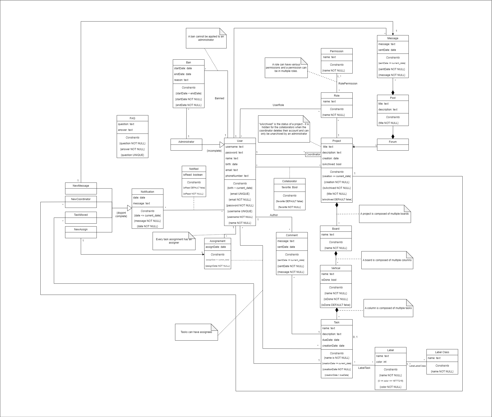

# EBD: Database Specification Component

## A4: Conceptual Data Model

This artifact objective is to illustrate the entities and relations between them that are relevant in our project context. 

For that, UML was used since it's common among the field and it's easy to understand.
This conceptual model will be used as a support to design the system's database.

### 1. Class diagram



### 2. Additional Business Rules

* BR06. A user can only send a message to a chat he has access to.
* BR07. A ban cannot be applied to an administrator.

## A5: Relational Schema, validation and schema refinement

This artifact contains the Relational Schema obtained by mapping from the Conceptual Data Model. The Relational Schema includes each relation schema, attributes, domains, primary keys, foreign keys and other integrity rules: UNIQUE (UK), DEFAULT (DF), NOT NULL (NN), CHECK (CK). A Schema Validation section was added to verify the normal form of each table. An Annex containing the SQL code to create de schema.

### Relational Schema

| **Relation reference** | **Relation Compact Notation**                                                                                                                                    |
| ------------------ | ------------------------------------------------------------------------------------------------------------------------------------------------------------ |
| R01                | users(id, username **UK** **NN**, password **NN**, name **NN**, birth **NN** **CK** birth < Today, email **UK** **NN**, phone\_number)                                                       |
| R02                | project(id, title **NN**, description, creation **NN** **CK** creation <= Today, is\_archived **NN** **DF** false, id\_coordinator->users **NN**)                                    |
| R03                | board(id, name **NN**, id\_project->project **NN**)                                                                                                                  |
| R04                | column(id, name **NN**, id\_board->board **NN**)                                                                                                                     |
| R05                | task(id, name **NN**, description, creation\_date **NN** **CK** creation\_date <= Today ,due\_date **CK** creation\_date < due\_date, id\_column->column **NN**, id\_chat->chat) |
| R06                | label(id, name **NN**, 1<= color **NN** <=16777215 )                                                                                                                 |
| R07                | label\_class(id, name **NN**)                                                                                                                                    |
| R08                | forum(id\_project\->project)                                                                                                                                 |
| R09                | chat(id, name **NN**, id\_forum->forum)                                                                                                                          |
| R10                | message(id, message **NN**, sent\_date **NN** **CK** sent\_date <= Today, id\_users->users **NN**, id\_chat->chat **NN**)                                                        |
| R11                | role(id, name **NN**, id\_project->project **NN**)                                                                                                                   |
| R12                | permission(id, name **NN**)                                                                                                                                      |
| R13                | administrator(id, id\_users->users **NN**)                                                                                                                       |
| R14                | ban(id, start\_date **NN**, end\_date **NN** **CK** start\_date < end\_date, reason, id\_users -> users **NN**, id\_administrator->administrator **NN**)                         |
| R15                | faq(id, question **NN** **UK**, answer **NN**)                                                                                                                           |
| R16                | notification(id, date **NN** **CK** date <= Today, message **NN**)                                                                                                       |
| R17                | new\_message(id\_notification\->notification, id\_message->message)                                                                                          |
| R18                | new\_coordinator(id\_notification\->notification, id\_project->project)                                                                                      |
| R19                | new\_assign(id\_notification\->notification, {id\_task, id\_users} -> assignment)                                                                            |
| R20                | task\_moved(id\_notification\->notification id\_task->task)                                                                                                  |
| R21                | assignment(id\_users\->users, id\_task\->task, assign\_date **NN** **CK** assignDate <= current\_date)                                                               |
| R22                | notified(id\_users\->users, id\_notification\->notification, isRead **NN** **DF** false)                                                                             |
| R23                | users\_role(id\_users\->users, id\_role\->role)                                                                                                              |
| R24                | collaborator(id\_users\->users, id\_project\->project, favorite **NN** **DF** false)                                                                                 |
| R25                | label\_label\_class(id\_label ->label, id\_label\_class -> label\_class)                                                                                     |
| R26                | label\_task(id\_label\->label, id\_task\->task)                                                                                                              |
| R27                | role\_permission(id\_role -> role, id\_permission -> permission)                                                                                             |

Legend:
* **UK** = UNIQUE KEY
* **NN** = NOT NULL
* **DF** = DEFAULT
* **CK** = CHECK

There are only two generalisations. One of them is in the User, an Administrator is specific kind of User that has more power.
Other generalisation is in the Notifications we have 4 kinds of notifications: New Message (a user receives a notification when they receive a new message), New Coordinator (a user is notified when some of the projects he is enrolled in changed coordinator), Task Moved (a user is notified when a task is moved from one column to another ) and New Assign (when the user is assigned to a task).


### 2. Domains

| Domain Name | Domain Specifications |
|-------------|-----------------------|
| Today | DATE DEFAULT CURRENT_DATE |


### 3. Schema validation

| Table R01 (user)                 | |
| ------------------------------- | - |
| Keys: {id}, {username}, {email} | |
| Functional Dependencies         | |
| FD0101                          | {id} -> {username, password, name, birth, email, phone\_number} |
| FD0102                          | {username} -> {id, password, name, birth, email, phone\_number} |
| FD0103                          | {email} -> {id, username, password, name, birth, phone\_number} |
| Normal Form                     | BCNF |

| Table R02 (project)     |   |
| ----------------------- | - |
| Keys: {id}              |   |
| Functional Dependencies |   |
| FD0201                  | {id} -> {title, description, creation, is\_archived, id\_coordinator} |
| Normal Form             | BCNF |

| Table R03 (board)       |   |
| ----------------------- | - |
| Keys: {id}              |   |
| Functional Dependencies |   |
| FD0301                  | {id} -> {name, id\_project} |
| Normal Form             | BCNF |

| Table R04 (vertical)      |   |
| ----------------------- | - |
| Keys: {id}              |   |
| Functional Dependencies |   |
| FD0401                  | {id} -> {name, id\_board} |
| Normal Form             | BCNF |

| Table R05 (task)        |  |
| ----------------------- | - |
| Keys: {id}              | |
| Functional Dependencies | |
| FD0501                  | {id} -> {name, description, creation\_date, due\_date, id\_vertical} |
| Normal Form             | BCNF |

| Table R06 (label)       |   |
| ----------------------- | - |
| Keys: {id}              |   |
| Functional Dependencies |   |
| FD0601                  | {id} -> {name, color} |
| Normal Form             | BCNF |

| Table R07 (label\_class) |   |
| ------------------------ | - |
| Keys: {id}               |   |
| Functional Dependencies  |   |
| FD0701                   | {id} -> {name} |
| Normal Form              | BCNF |

| Table R08 (forum)       |   |
| ----------------------- | - |
| Keys: {forum\_id}       |   |
| Functional Dependencies | none |
| Normal Form             | BCNF |

| Table R09 (chat)        | |
| ----------------------- | - |
| Keys: {id}              | |
| Functional Dependencies | |
| FD0901                  | {id} -> {name} |
| Normal Form             | BCNF |

| Table R10 (message)     |   |
| ----------------------- | - |
| Keys: {id}              |   |
| Functional Dependencies |   |
| FD1001                  | {id} -> {message, sent\_date, id\_user, id\_chat} |
| Normal Form             | BCNF |

| Table R11 (role)        |   |
| ----------------------- | - |
| Keys: {id}              |   |
| Functional Dependencies |   |
| FD1101                  | {id} -> {name, id\_project} |
| Normal Form             | BCNF |

| Table R12 (permission)  |   |
| ----------------------- | - |
| Keys: {id}              |   |
| Functional Dependencies |   |
| FD1201                  | {id} -> {name} |
| Normal Form             | BCNF |

| Table R13 (administrator) |   |
| ------------------------- | - |
| Keys: {id}                |   |
| Functional Dependencies   |   |
| FD1301                    | {id} -> {id\_user} |
| Normal Form               | BCNF |

| Table R14 (ban)         |   |
| ----------------------- | - |
| Keys: {id}              |   |
| Functional Dependencies |   |
| FD1401                  | {id} -> {start\_date, end\_date, reason, id\_user, id\_administrator} |
| Normal Form             | BCNF |

| Table R15 (faq)                                    |   |
| -------------------------------------------------- | - |
| Keys: {id}, {question}                             |   |
| Functional Dependencies                            |   |
| FD1501                                             | {id} -> {question, answer} |
| FD1502                                             | {question} -> {id, answer} |
| Normal Form                                        | BCNF |

| Table R16 (notification)         |   |
| ----------------------- | - |
| Keys: {id}              |   |
| Functional Dependencies |   |
| FD1601                  | {id} -> {date, message} |
| Normal Form             | BCNF |

| Table R17 (new_message)  |   |
| ------------------------ | - |
| Keys: {id\_notification} |   |
| Functional Dependencies  |   |
| FD1801                   | {id\_notification} -> {id\_message} |
| Normal Form              | BCNF |

| Table R18 (new\_coordinator) |   |
| ---------------------------- | - |
| Keys: {id\_notification}     |   |
| Functional Dependencies      |   |
| FD1901                       | {id\_notification} -> {id\_project} |
| Normal Form                  | BCNF |

| Table R19 (new\_assign)   |   |
| ------------------------ | - |
| Keys: {id\_notification} |   |
| Functional Dependencies  |   |
| FD2001                   | {id\_notification} -> {id\_assignment} |
| Normal Form              | BCNF |

| Table R20 (task\_moved)   |   |
| ------------------------ | - |
| Keys: {id\_notification} |   |
| Functional Dependencies  |   |
| FD2101                   | {id\_notification} -> {id\_task} |
| Normal Form              | BCNF |

| Table 21 (assignment)     | |
| -------------------------- | - |
| Keys: {id\_user, id\_task} | |
| Functional Dependencies    | |
| FD22101                     | {id\_user, id\_task} -> {assign\_date} |
| Normal Form                | BCNF |

| Table R22 (notified)               | |
| ---------------------------------- | - |
| Keys: {id\_user, id\_notification} | |
| Functional Dependencies            | |
| FD23201                             | {id\_user, id\_notification} -> {isRead} |
| Normal Form                        | BCNF |

| Table R23 (user\_role)     | |
| -------------------------- | - |
| Keys: {id\_user, id\_role} | |
| Functional Dependencies    | none |
| Normal Form                | BCNF |

| Table R24 (collaborator)      | |
| ----------------------------- | - |
| Keys: {id\_user, id\_project} | |
| Functional Dependencies       | |
| FD2501                        | {id\_user, id\_project} -> {favorite} |
| Normal Form                   | BCNF |

| Table R25 (label\_label\_class)     | |
| ----------------------------------- | - |
| Keys: {id\_label, id\_label\_class} | |
| Functional Dependencies             | none |
| Normal Form                         | BCNF |

| Table R26 (label\_task)     | |
| --------------------------- | - |
| Keys: {id\_label, id\_task} | |
| Functional Dependencies     | none |
| Normal Form                 | BCNF |

| Table R27 (role\_permission)     | |
| -------------------------------- | - |
| Keys: {id\_role, id\_permission} | |
| Functional Dependencies          | none |
| Normal Form                      | BCNF |

Because all relations are in the Boyce–Codd Normal Form (BCNF), the relational schema is also in the BCNF and, therefore, the schema does not need to be further normalized.

### 4. Annex A. SQL Code

#### 4.1 Database schema

[Annex A.1 Database schema](../schema.sql)

#### 4.2 Database population

[Annex A.2 Database population](../population.sql)

## A6: Indexes, triggers, transactions and database population

This artifact contains the physical schema of the database, the identification and characterisation of the indexes, the support of data integrity rules with triggers and the definition of the database user-defined functions.
Furthermore, it also shows the database transactions needed to assure the integrity of the data in the presence of concurrent accesses. For each transaction, the isolation level is explicitly stated and justified.
This artifact also contains the database's workload as well as the complete database creation script, including all SQL necessary to define all integrity constraints, indexes and triggers. Finally, this artifact also includes a separate script with INSERT statements to populate the database.

### 1. Database Workload

| **Relation** | **Relation name**       | **Order of magnitude**            | **Estimated growth**     |
| ------------ | ----------------------- | --------------------------------- | -------------------- |
| R01          | users                   | 10 k (tens of thousands)          | 10 (tens) / day      |
| R02          | project                 | 1 k (thousands)                   | 1 (units) / day      |
| R03          | board                   | 1 k                               | 1 / day              |
| R04          | column                  | 10 k                              | 10 / day             |
| R05          | task                    | 100 k (hundreds of thousands)     | 100 (hundreds) / day |
| R06          | label                   | 10 k                              | 1 / day              |
| R07          | label\_class            | 1 k                               | 1 / day              |
| R08          | forum                   | 1 k                               | 1 / day              |
| R09          | chat                    | 100 k                             | 100 / day            |
| R10          | message                 | 1 kk (millions)                   | 1 k / day            |
| R11          | role                    | 1 k                               | 1 / day              |
| R12          | permission              | 10                                | 1 / month            |
| R13          | administrator           | 10                                | 1 / month            |
| R14          | ban                     | 100                               | 1 / day              |
| R15          | faq                     | 1                                 | 1 / month            |
| R16          | notification            | 1 kk                              | 1 k / day            |
| R17          | new\_message            | 1 kk                              | 1 k / day            |
| R18          | new\_coordinator        | 100                               | 1 / day              |
| R19          | new\_assign             | 100 k                             | 100 / day            |
| R20          | task\_moved             | 100 k                             | 100 / day            |
| R21          | assignment              | 100 k                             | 100 / day            |
| R22          | notified                | 1 kk                              | 1 k / day            |
| R23          | users\_role             | 10 k                              | 1 / day              |
| R24          | collaborator            | 10 k                              | 10 / day             |
| R25          | label\_label\_class     | 10 k                              | 10 / day             |
| R26          | label\_task             | 100 k                             | 10 / day             |
| R27          | role\_permission        | 1 k                               | 1 / day              |

### 2. Indexes

#### 2.1 Performance indexes

| Index                                                                      | IDX01                                                                                                                                                                                                                                                                                                                                                                                                                  |
| -------------------------------------------------------------------------- | ---------------------------------------------------------------------------------------------------------------------------------------------------------------------------------------------------------------------------------------------------------------------------------------------------------------------------------------------------------------------------------------------------------------------- |
| Index relation                                                             | collaborator                                                                                                                                                                                                                                                                                                                                                                                                           |
| Index attribute                                                            | id\_users                                                                                                                                                                                                                                                                                                                                                                                                              |
| Index type                                                                 | Hash                                                                                                                                                                                                                                                                                                                                                                                                                   |
| Cardinality                                                                | Medium                                                                                                                                                                                                                                                                                                                                                                                                                 |
| Clustering                                                                 | Yes                                                                                                                                                                                                                                                                                                                                                                                                                    |
| Justification                                                              | Since fetching the user’s projects will be a frequent enough operation, a performance index for the collaborator table on the id\_users attribute would be useful. The cardinality is medium since there may be repeated id\_users values. Sorting id\_users is also not required so a hashmap was chosen. Clustering was added because fetching all the user’s projects will be needed and the cardinality is medium. |
| SQL Code                                                                          |
 ```sql
CREATE INDEX user_projects_index ON collaborator USING hash (id_users); 
``` 

| Index                                                                | IDX02                                                                                                                                                                                                                                                                                                                                                                                                          |
| -------------------------------------------------------------------- | -------------------------------------------------------------------------------------------------------------------------------------------------------------------------------------------------------------------------------------------------------------------------------------------------------------------------------------------------------------------------------------------------------------- |
| Index relation                                                       | comment                                                                                                                                                                                                                                                                                                                                                                                                        |
| Index attribute                                                      | id\_task                                                                                                                                                                                                                                                                                                                                                                                                       |
| Index type                                                           | Hash                                                                                                                                                                                                                                                                                                                                                                                                           |
| Cardinality                                                          | Medium                                                                                                                                                                                                                                                                                                                                                                                                         |
| Clustering                                                           | Yes                                                                                                                                                                                                                                                                                                                                                                                                            |
| Justification                                                        | Since fetching the task’s comments will be a frequent enough operation, a performance index for the comment table on the id\_task attribute would be useful. The cardinality is medium since there may be repeated id\_task values. Sorting id\_task is also not required so a hashmap was chosen. Clustering was added because fetching all the task’s comments will be needed and the cardinality is medium. |
| SQL Code                                                                          |
 ```sql
CREATE INDEX task_comments_index ON comment USING hash (id_task); 
``` 

| Index                                                                | IDX03                                                                                                                                                                                                                                                                                                                                                                                                             |
| -------------------------------------------------------------------- | ----------------------------------------------------------------------------------------------------------------------------------------------------------------------------------------------------------------------------------------------------------------------------------------------------------------------------------------------------------------------------------------------------------------- |
| Index relation                                                       | task                                                                                                                                                                                                                                                                                                                                                                                                              |
| Index attribute                                                      | id\_vertical                                                                                                                                                                                                                                                                                                                                                                                                      |
| Index type                                                           | Hash                                                                                                                                                                                                                                                                                                                                                                                                              |
| Cardinality                                                          | Medium                                                                                                                                                                                                                                                                                                                                                                                                            |
| Clustering                                                           | Yes                                                                                                                                                                                                                                                                                                                                                                                                               |
| Justification                                                        | Since fetching the task’s columns will be a frequent enough operation, a performance index for the task table on the id\_task attribute would be useful. The cardinality is medium since there may be repeated id\_vertical values. Sorting id\_vertical is also not required so a hashmap was chosen. Clustering was added because fetching all the task’s columns will be needed and the cardinality is medium. |
| SQL Code                                                                          |
 ```sql
CREATE INDEX column_tasks_index ON task USING hash (id_vertical); 
``` 

| Index                                                                    | IDX04                                                                                                                                                                                                                                                                                                                                                                                                              |
| ------------------------------------------------------------------------ | ------------------------------------------------------------------------------------------------------------------------------------------------------------------------------------------------------------------------------------------------------------------------------------------------------------------------------------------------------------------------------------------------------------------ |
| Index relation                                                           | vertical                                                                                                                                                                                                                                                                                                                                                                                                           |
| Index attribute                                                          | id\_board                                                                                                                                                                                                                                                                                                                                                                                                          |
| Index type                                                               | Hash                                                                                                                                                                                                                                                                                                                                                                                                               |
| Cardinality                                                              | Medium                                                                                                                                                                                                                                                                                                                                                                                                             |
| Clustering                                                               | Yes                                                                                                                                                                                                                                                                                                                                                                                                                |
| Justification                                                            | Since fetching the board’s columns will be a frequent enough operation, a performance index for the vertical table on the id\_board attribute would be useful. The cardinality is medium since there may be repeated id\_board values. Sorting id\_board is also not required so a hashmap was chosen. Clustering was added because fetching all the board’s columns will be needed and the cardinality is medium. |
| SQL Code                                                                          |
 ```sql
CREATE INDEX board_verticals_index ON vertical USING hash (id_board); 
``` 

| Index                                                                  | IDX05                                                                                                                                                                                                                                                                                                                                                                                                                   |
| ---------------------------------------------------------------------- | ----------------------------------------------------------------------------------------------------------------------------------------------------------------------------------------------------------------------------------------------------------------------------------------------------------------------------------------------------------------------------------------------------------------------- |
| Index relation                                                         | board                                                                                                                                                                                                                                                                                                                                                                                                                   |
| Index attribute                                                        | id\_project                                                                                                                                                                                                                                                                                                                                                                                                             |
| Index type                                                             | Hash                                                                                                                                                                                                                                                                                                                                                                                                                    |
| Cardinality                                                            | Medium                                                                                                                                                                                                                                                                                                                                                                                                                  |
| Clustering                                                             | Yes                                                                                                                                                                                                                                                                                                                                                                                                                     |
| Justification                                                          | Since fetching the project’s boards will be a frequent enough operation, a performance index for the board table on the id\_project attribute would be useful. The cardinality is medium since there may be repeated id\_project values. Sorting id\_project is also not required so a hashmap was chosen. Clustering was added because fetching all the project’s boards will be needed and the cardinality is medium. |
| SQL Code                                                                          |
 ```sql
CREATE INDEX project_boards_index ON board USING hash (id_project); 
``` 

| Index                                                                  | IDX06                                                                                                                                                                                                                                                                                                                                                                                                          |
| ---------------------------------------------------------------------- | -------------------------------------------------------------------------------------------------------------------------------------------------------------------------------------------------------------------------------------------------------------------------------------------------------------------------------------------------------------------------------------------------------------- |
| Index relation                                                         | label\_task                                                                                                                                                                                                                                                                                                                                                                                                    |
| Index attribute                                                        | id\_task                                                                                                                                                                                                                                                                                                                                                                                                       |
| Index type                                                             | Hash                                                                                                                                                                                                                                                                                                                                                                                                           |
| Cardinality                                                            | Medium                                                                                                                                                                                                                                                                                                                                                                                                         |
| Clustering                                                             | Yes                                                                                                                                                                                                                                                                                                                                                                                                            |
| Justification                                                          | Since fetching the task’s labels will be a frequent enough operation, a performance index for the label\_task table on the id\_task attribute would be useful. The cardinality is medium since there may be repeated id\_task values. Sorting id\_task is also not required so a hashmap was chosen. Clustering was added because fetching all the task’s labels will be needed and the cardinality is medium. |
| SQL Code                                                                          |
 ```sql
CREATE INDEX task_labels_index ON label_task USING hash (id_task); 
``` 

| Index                                                                       | IDX07                                                                                                                                                                                                                                                                                                                                                                                                                        |
| --------------------------------------------------------------------------- | ---------------------------------------------------------------------------------------------------------------------------------------------------------------------------------------------------------------------------------------------------------------------------------------------------------------------------------------------------------------------------------------------------------------------------- |
| Index relation                                                              | notified                                                                                                                                                                                                                                                                                                                                                                                                                     |
| Index attribute                                                             | id\_users                                                                                                                                                                                                                                                                                                                                                                                                                    |
| Index type                                                                  | Hash                                                                                                                                                                                                                                                                                                                                                                                                                         |
| Cardinality                                                                 | Medium                                                                                                                                                                                                                                                                                                                                                                                                                       |
| Clustering                                                                  | Yes                                                                                                                                                                                                                                                                                                                                                                                                                          |
| Justification                                                               | Since fetching the user’s notifications will be a frequent enough operation, a performance index for the notified table on the id\_users attribute would be useful. The cardinality is medium since there may be repeated id\_users values. Sorting id\_users is also not required so a hashmap was chosen. Clustering was added because fetching all the user’s notifications will be needed and the cardinality is medium. |
| SQL Code                                                                          |
 ```sql
CREATE INDEX user_notifications_index ON notified USING hash (id_users); 
``` 

| Index                                                                             | IDX08                                                                                                                                                                                                         |
| --------------------------------------------------------------------------------- | ------------------------------------------------------------------------------------------------------------------------------------------------------------------------------------------------------------- |
| Index relation                                                                    | notification                                                                                                                                                                                                  |
| Index attribute                                                                   | sent\_date                                                                                                                                                                                                    |
| Index type                                                                        | Btree                                                                                                                                                                                                          |
| Cardinality                                                                       | Medium                                                                                                                                                                                                        |
| Clustering                                                                        | No                                                                                                                                                                                                           |
| Justification                                                                     | We predict the use of date filtering on notifications, i.e to see the most recent notifications. So a performance index for the notification table on the sent\_date attribute using a btree was implemented. |
| SQL Code                                                                          |
 ```sql
CREATE INDEX notifications_date_index ON notification USING btree (sent_date); 
``` 

#### 2.2 Full-text Search indexes

### Triggers

| Trigger                                                                                                                                                                                                                                                                                                                                                                                                                                                                                                                                                 | TRIGGER01                                                    |
| ------------------------------------------------------------------------------------------------------------------------------------------------------------------------------------------------------------------------------------------------------------------------------------------------------------------------------------------------------------------------------------------------------------------------------------------------------------------------------------------------------------------------------------------------------- | ------------------------------------------------------------ |
| Description                                                                                                                                                                                                                                                                                                                                                                                                                                                                                                                                             | An user can only send a message in a forum he has access to. |
| SQL Code                                                                                                                                                                                                                                                                                                                                                                                                                                                                                                                                                |
| 
```sql 
CREATE FUNCTION send_message() RETURNS TRIGGER AS
$BODY$
BEGIN
    IF NOT EXISTS (SELECT * FROM collaborator WHERE id_user = NEW.id_user AND id_project IN (SELECT id_forum AS id_project FROM post WHERE id IN (SELECT id_post AS id FROM msg WHERE NEW.id = id))) THEN
        RAISE EXCEPTION 'User does not have access to this forum';
    END IF;
    RETURN NEW;
END
$BODY$
LANGUAGE plpgsql;

CREATE TRIGGER send_message
    BEFORE INSERT OR UPDATE ON msg
    FOR EACH ROW
    EXECUTE PROCEDURE send_message();
``` 
|

| Trigger                                                                                                                                                                                                                                                                                                                                                                                                                                        | TRIGGER02                                    |
| ---------------------------------------------------------------------------------------------------------------------------------------------------------------------------------------------------------------------------------------------------------------------------------------------------------------------------------------------------------------------------------------------------------------------------------------------- | -------------------------------------------- |
| Description                                                                                                                                                                                                                                                                                                                                                                                                                                    | A ban cannot be applied to an admninistrator |
| SQL Code                                                                                                                                                                                                                                                                                                                                                                                                                                       |
| 
```sql
CREATE FUNCTION issue_ban() RETURNS TRIGGER AS
$BODY$
BEGIN
    IF EXISTS (SELECT * FROM administrator WHERE id_users IN (SELECT id_users AS banned_id FROM ban WHERE NEW.id = id)) THEN
        RAISE EXCEPTION 'Cannot ban an administrator';
END IF;
    RETURN NEW;
END
$BODY$
LANGUAGE plpgsql;

CREATE TRIGGER issue_ban
    BEFORE INSERT OR UPDATE ON ban
    FOR EACH ROW
    EXECUTE PROCEDURE issue_ban(); 
``` 
|

| Trigger                                                                                                                                                                                                                                                                                                                                                                                                                                                                                                                                                                                                                                                                                              | TRIGGER03                             |
| ---------------------------------------------------------------------------------------------------------------------------------------------------------------------------------------------------------------------------------------------------------------------------------------------------------------------------------------------------------------------------------------------------------------------------------------------------------------------------------------------------------------------------------------------------------------------------------------------------------------------------------------------------------------------------------------------------- | ------------------------------------- |
| Description                                                                                                                                                                                                                                                                                                                                                                                                                                                                                                                                                                                                                                                                                          | Issue notification on task assignment |
| SQL Code                                                                                                                                                                                                                                                                                                                                                                                                                                                                                                                                                                                                                                                                                             |
| 
```sql 
CREATE FUNCTION notify_assignment() RETURNS TRIGGER AS
$BODY$
DECLARE
    id_notf INTEGER;
BEGIN
        INSERT INTO notification(sent_date, msg)
        VALUES (current_date, 'You have been assigned a new task.') RETURNING id INTO id_notf;
        INSERT INTO new_assign(id_notification, id_users, id_task)
        VALUES (id_notf, NEW.id_users, NEW.id_task);
        INSERT INTO notified(id_users, id\_notification)
        VALUES (NEW.id_users, id_notf);
    RETURN NEW;
END
$BODY$
LANGUAGE plpgsql;

CREATE TRIGGER notify_assignment
    AFTER INSERT OR UPDATE ON assignmnt
    FOR EACH ROW
    EXECUTE PROCEDURE notify_assignment(); 
```    
|

| Trigger                                                                                                                                                                                                                                                                                                                                                                                                                                                                                                                                                                                                                                                                                                                                                                                       | TRIGGER04                             |
| --------------------------------------------------------------------------------------------------------------------------------------------------------------------------------------------------------------------------------------------------------------------------------------------------------------------------------------------------------------------------------------------------------------------------------------------------------------------------------------------------------------------------------------------------------------------------------------------------------------------------------------------------------------------------------------------------------------------------------------------------------------------------------------------- | ------------------------------------- |
| Description                                                                                                                                                                                                                                                                                                                                                                                                                                                                                                                                                                                                                                                                                                                                                                                   | Issue notification on new coordinator |
| SQL Code                                                                                                                                                                                                                                                                                                                                                                                                                                                                                                                                                                                                                                                                                                                                                                                      |
| 
```sql
CREATE FUNCTION notify_new_coordinator() RETURNS TRIGGER AS
$BODY$
DECLARE
    id_notf INTEGER;
BEGIN
        INSERT INTO notification(sent_date, msg)
        VALUES (current_date, 'One of your projects has a new coordinator') RETURNING id INTO id_notf;
        INSERT INTO new_coordinator(id_notification, id_project)
        VALUES (id_noft, NEW.id);
        INSERT INTO notified(id_users, id_notification)
            SELECT id_users, id AS id_notification FROM collaborator CROSS JOIN notification WHERE id_project = NEW.id AND id = id_notf;
    RETURN NEW;
END
$BODY$
LANGUAGE plpgsql;

CREATE TRIGGER notify_new_coordinator
    AFTER UPDATE ON project
    FOR EACH ROW
    EXECUTE PROCEDURE notify_new_coordinator(); 
```
|

| Trigger                                                                                                                                                                                                                                                                                                                                                                                                                                                                                                                                                                                                                                                                                                                                                                                                                                                                        | TRIGGER05                        |
| ------------------------------------------------------------------------------------------------------------------------------------------------------------------------------------------------------------------------------------------------------------------------------------------------------------------------------------------------------------------------------------------------------------------------------------------------------------------------------------------------------------------------------------------------------------------------------------------------------------------------------------------------------------------------------------------------------------------------------------------------------------------------------------------------------------------------------------------------------------------------------ | -------------------------------- |
| Description                                                                                                                       | Issue notification on moved task |
| SQL Code                                                                    
| 
```sql
CREATE FUNCTION notify_moved_task() RETURNS TRIGGER AS
$BODY$
DECLARE
    id_notf INTEGER;
BEGIN
    IF NOT EXISTS (SELECT * FROM task WHERE id = NEW.id AND id_vertical = NEW.id_vertical) THEN
        INSERT INTO notification(sent_date, msg)
        VALUES (current_date, 'A task you are assigned to has been moved') RETURNING id INTO id_notf;
        INSERT INTO task_moved(id_notification, id_task)
        VALUES (id_noft, NEW.id);
        INSERT INTO notified(id_users, id_notification)
            SELECT id_users, id AS id_notification FROM assignmnt CROSS JOIN notification WHERE id = id_notf AND id\_task = NEW.id;
    END IF;
    RETURN NEW;
END
$BODY$
LANGUAGE plpgsql;

CREATE TRIGGER notify_moved_task
    BEFORE UPDATE ON task
    FOR EACH ROW
    EXECUTE PROCEDURE notify_moved_task(); 
```
|


| Trigger                                                                                                                                                                                                                                                                                                                                                                                                                                                                                                                                                                                                                                                                                                                                                                                                                              | TRIGGER06                         |
| ------------------------------------------------------------------------------------------------------------------------------------------------------------------------------------------------------------------------------------------------------------------------------------------------------------------------------------------------------------------------------------------------------------------------------------------------------------------------------------------------------------------------------------------------------------------------------------------------------------------------------------------------------------------------------------------------------------------------------------------------------------------------------------------------------------------------------------ | --------------------------------- |
| Description                                                                                                                                                                                                                                                                                                                                                                                                                                                                                                                                                                                                                                                                                                                                                                                                                          | Issue notification on new message |
| SQL Code                                                                                                                                                                                                                                                                                                                                                                                                                                                                                                                                                                                                                                                                                                                                                                                                                             |
| 
```sql
CREATE FUNCTION notify_message() RETURNS TRIGGER AS
$BODY$
DECLARE
    id_notf INTEGER;
BEGIN
        INSERT INTO notification(sent_date, msg)
        VALUES (current_date, 'You have received a new message.') RETURNING id INTO id_notf;
        INSERT INTO new_message(id_notification, id_message)
        VALUES (id_noft, NEW.id);
        INSERT INTO notified(id_users, id_notification)
            SELECT id_users, id AS id_notification FROM collaborator CROSS JOIN notification WHERE id_project IN (SELECT id\_forum FROM chat WHERE id IN (SELECT id_chat FROM message WHERE NEW.id = id)) AND id = id_notf;
    RETURN NEW;
END
$BODY$
LANGUAGE plpgsql;

CREATE TRIGGER notify_message
    AFTER INSERT ON msg
    FOR EACH ROW
    EXECUTE PROCEDURE notify_message();
```
|


| Trigger                                                                                                                                                                                                                                                                                                                                                                                                         | TRIGGER07                                                |
| --------------------------------------------------------------------------------------------------------------------------------------------------------------------------------------------------------------------------------------------------------------------------------------------------------------------------------------------------------------------------------------------------------------- | -------------------------------------------------------- |
|                                                                                                                                                                                                                                                                                                                                                                                                                 |                                                          |
| Description                                                                                                                                                                                                                                                                                                                                                                                                     | Archive project when its coordinator deletes his account |
| SQL Code                                                                                                                                                                                                                                                                                                                                                                                                        |
```sql
CREATE FUNCTION archive_project() RETURNS TRIGGER AS
$BODY$
BEGIN
     UPDATE project
     SET is_archived = true
         id_coordinator = null
     WHERE id IN (SELECT id FROM project WHERE id_coordinator = OLD.id);
     RETURN OLD;
END
$BODY$
LANGUAGE plpgsql;

CREATE TRIGGER archive_project
BEFORE DELETE ON users
FOR EACH ROW
EXECUTE PROCEDURE archive_project();
```
|

### Transaction
| Transaction                                                                                                                                                                                                                                                                                     | TRAN01                                                                                                                                                                                                                                                        |
| ----------------------------------------------------------------------------------------------------------------------------------------------------------------------------------------------------------------------------------------------------------------------------------------------- | ------------------------------------------------------------------------------------------------------------------------------------------------------------------------------------------------------------------------------------------------------------- |
| Description                                                                                                                                                                                                                                                                                     | Get comments and their number                                                                                                                                                                                                                                 |
| Justification                                                                                                                                                                                                                                                                                   | In the middle of the transaction, the insertion of new rows in the comment table can occur, which implies that the information retrieved in both selects is different, consequently resulting in a Phantom Read. It's READ ONLY because it only uses Selects. |
| Isolation Level                                                                                                                                                                                                                                                                                 |                                                                                                                                                                                                                                                               |
| SQL Code                                                                                                                                                                                                                                                                                        |
| 
```sql
BEGIN TRANSACTION;

SET TRANSACTION ISOLATION LEVEL SERIALIZABLE READ ONLY;

\-- Get number of current comments on a task
SELECT COUNT(\*)
FROM comment
WHERE task\_id=$id;

\-- Get comments on a task
SELECT \*
FROM loan
WHERE task\_id=$id;

END TRANSACTION; 
```
|