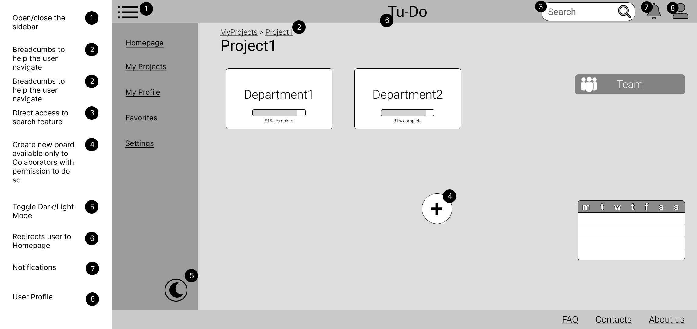

# ER: Requirements Specification Component

## A1: Tu-Do

### Motivation and Context
As college students, we have to deal with various teams and work in different group projects along the semester. The due dates get overwhelming and a good planning of these projects is essential for a good semester.  For that reason, we decided to create Tu-Do. A web based information system where one could centralize and manage all their personal or team projects and communicate with their teams! Having access to a lot of features for the better organisation and division of work.

### Goals and Objectives

The main goal of Tu-Do is to give people a convenient way for managing projects, either working by themselves or with a team. From simple tasks like organizing house chores to complex ones like managing software development in a huge company, Tu-Do aims to provide a complete, yet easy and interactive environment to do so.

### Features

After setting up an account, either by your own initiative or by receiving an email invitation, Tu-Do allows its users to create new projects or to be invitied by someone else to an existing one. Once he is part of a project, the user will be able to access its boards, where he and his team (if there is one) share an intuitive interface for creating, managing and assigning tasks. This way the whole squad can easily keep track of what needs to be done, who should do it, along with other details, as well as seeing their progress by marking tasks as completed.  
Since communication is essential to a project's success, we offer all members of a project a simple way to view information about the elements of his team, including their contacts, so the team can always stay in touch.  
To keep the workflow in order, every team will have a coordinator responsible for inviting and removing members, assigning members to tasks, managing every detail about the project and its tasks and might even choose to step down and appoint a more capable coordinator.  
Tu-Do helps its users stay organized by keeping all their projects easily accessable in their profile and allows them to mark them as favorite so they can stay focused on whats more important. It also provides a powerful search feature so our users can find any information they might be looking for.  
Finally, Tu-Do is very keen on having a welcoming and clean platform, so our administrators are able to browse every project and view their details, to ensure nothing sketchy is going on, and will terminate user accounts that are disrespectul or offensive.  

### Access Groups

Tu-Do has 5 main types of users: *Guest* users, which have not authenticated themselves into the system will only have a very basic access to the platform. Once they register an account and log in, they become *Authenticated Users*. This type of user unlocks the ability to take part in projects and will have a profile of his own. When an user becomes part of a project they are called *Collaborators*, unlocking all the helpful project and task management features that Tu-Do provides. Every project will have a special type of Collaborator called the *Coordinator*. The Coordinator's job is, well, to coordinate! He is responsible for managing the project, its tasks, and its collaborators. Finally, there is a special type of account responsible for moderating the platform: the *Administrator*. The role is only given to a few trustworthy individuals and they are trusted to keep the platform as friendly as possible.

## 2. A2: Actors and User stories

> For the *Tu-Do* system, consider the actors and user stories that are presented in the following sections.

### 2.1 Actors

<section style="display: flex;background-color:white;justify-content: center;padding:1em 0em;">
    
</section>

*Figure 1: Tu-Do actors.*

| **Identifier**     | **Description**                                                                                                                                                                                                  |
|--------------------|------------------------------------------------------------------------------------------------------------------------------------------------------------------------------------------------------------------|
| User               | Basic user with very minimal access.                                                                                                                                                                             |
| Guest              | An unauthenticated user that can log-in if he already has an account, or register a new one.                                                                                                                     |
| Authenticated User | A logged-in user that is able to create new projects and accept invites to existing ones.                                                                                                                        |
| Collaborator       | An authenticated user that is part of a project. He is able to view the details of the project and be assigned tasks. His permissions within a project may vary.                                                 |
| Coordinator        | An authenticated user that has the most permissions within a project. He can manage everything related to the project and give permissions to other collaborators. May also choose to appoint a new coordinator. |
| Administrator      | A special type of account that is responsible for moderating the platform. He is able to terminate user accounts and projects.                                                                                   |

*Table 1: Tu-Do actors description.*

### 2.2 User Stories

#### 2.2.1 Guest

<table>
  <tr> <th>Identifier</th><th>Name</th><th>Priority</th><th>Description</th></tr>
  <tr><td>US01  </td><td>Sign-in  </td><td>high  </td><td>As a Guest, I want to authenticate into the system, so that I can access privileged information. </td></tr>
  <tr><td>US02  </td><td>Guest Sign-up  </td><td>high  </td><td>As a Guest, I want to register myself into the system, so that I can authenticate myself into the system. </td></tr>
  <tr><td>US03  </td><td>Recover Password</td><td>medium  </td><td>As a Guest, I want to recover my password, so that if it happens that I forget it I can still have access to the app. </td></tr>
  <tr><td>US04  </td><td>Sign-in with Google</td><td>low  </td><td>As a Guest, I want to sign-in through my Google account, so that I can authenticate myself into the system. </td></tr>
  <tr><td>US05  </td><td>Sign-up with Google</td><td>low  </td><td>As a Guest, I want to register a new account linked to my Google account, so that I do not need to create a whole new account to use the platform. </td></tr>

</table>

*Table 1: Guest user stories*

#### 2.2.2 User

<table>
  <tr><th>Identifier</th><th>Name</th><th>Priority</th><th>Description</th></tr>
  <tr><td>US06  </td><td>See Home  </td><td>high  </td><td>As an User, I want to access the home page, so that I can see a brief presentation of the website. </td></tr>
  <tr><td>US07  </td><td>Search (full text and exact match) </td><td>high  </td><td>As an User, I want to search the platform keywords, so that I can quickly find users and/or projects that I am looking for. </td></tr>
  <tr><td>US08  </td><td>See About Us  </td><td>medium  </td><td>As an User, I want to access the about page, so that I can see a complete description of the website and its creators. </td></tr>
  <tr><td>US09  </td><td>See Main Features  </td><td>medium  </td><td>As an User, I want to have access to a page that lists the main features of the product, so that I know what use it can have for me. </td></tr>
  <tr><td>US10  </td><td>Accept Email Invitation  </td><td>medium  </td><td>As an User, I want to accept email invitations to projects, so that, if I accept, other users can add me to their projects as a collaborator. </td></tr>
  <tr><td>US11  </td><td>Search Filters  </td><td>medium  </td><td>As an User, I want to have the ability to filter the contents that I see (by category, etc.),so that I can find the content easily.</td></tr>
  <tr><td>US12  </td><td>See Contacts  </td><td>medium  </td><td>As an User, I want to see the Contact Us page, so that I can know how to reach out to the owners of the website and its creators. </td></tr>
  <tr><td>US13  </td><td>Change to dark/light mode  </td><td>medium  </td><td>As an User, I want to be able to switch between dark and light mode, so that I can better adapt the website to my preferences. </td></tr>
  <tr><td>US14  </td><td>Sort  </td><td>low  </td><td>As an User, I want to have the ability to sort search results, so that I can find content easily. </td></tr>
  <tr><td>US15  </td><td>See FAQ  </td><td>low  </td><td>As an User, I want to see the FAQ page, so that I can get answers to common questions that I might have. </td></tr>
</table>

*Table 2: User user stories*

#### 2.2.3 Authenticated User

  <table>
  <tr><th>Identifier</th><th>Name</th><th>Priority</th><th>Description</th></tr>
  <tr><td>US16  </td><td>Project Creation  </td><td>high  </td><td>As an Authenticated User, I want to be able to create a project, so that I can define tasks needed to accomplish it and centralize them. </td></tr>
  <tr><td>US17  </td><td>Logout  </td><td>high  </td><td>As an Authenticated User, I want to Logout of the system, so that my session terminates, and no one can have access to It during my absence. </td></tr>
  <tr><td>US18  </td><td>View my projects  </td><td>high  </td><td>As an Authenticated User, I want to view all my projects, so that I can have an overview and select one of them. </td></tr>
  <tr><td>US19  </td><td>View profile  </td><td>high  </td><td>As an Authenticated User, I want to view my profile, so that I can see my profile details. </td></tr>
  <tr><td>US20  </td><td>Edit profile  </td><td>high  </td><td>As an Authenticated User, I want to edit my user profile, so that I can change my details as I desire or update them. </td></tr>
  <tr><td>US21  </td><td>Delete Account  </td><td>medium  </td><td>As an Authenticated User, I want to delete my account, so that my account abandons the system. </td></tr>
  <tr><td>US22  </td><td>Support Profile Picture  </td><td>medium  </td><td>As an Authenticated User, I want to have the ability to change my profile picture, so that people that I am in a team with can recognize my face. </td></tr>
  <tr><td>US23  </td><td>Favorite Projects  </td><td>medium  </td><td>As an Authenticated User, I want to favorite certain projects, so that I can have faster access to them. </td></tr>
  <tr><td>US24  </td><td>Project Invitation managing  </td><td>low  </td><td>As an Authenticated User, I want to manage my project invitations, so that I can accept/reject invitations according to my preferences. </td></tr>
</table>

*Table 3: Authenticated User user stories*

#### 2.2.4 Collaborator

<table>
  <tr><th>Identifier</th><th>Name</th><th>Priority</th><th>Description</th></tr>
  <tr><td>US25  </td><td>Task Creation  </td><td>high  </td><td>As a Collaborator, I want to be able to create tasks, so that I can contribute to the organization of the project. </td></tr>
  <tr><td>US26  </td><td>Task Management  </td><td>high  </td><td>As a Collaborator, I want to be able to manage tasks and change some aspects like their priority, due date and other labels, so that I can better organize them. </td></tr>
  <tr><td>US27  </td><td>Task Deletion  </td><td>medium  </td><td>As a Collaborator, I want to be able to delete tasks that I created, so that I can focus on the most important tasks. </td></tr>
  <tr><td>US28  </td><td>Comment on a task  </td><td>medium  </td><td>As a Collaborator, I want to be able to comment on tasks, so that I can expose its progress and share useful information about it. </td></tr>
  <tr><td>US29  </td><td>Assign users to task  </td><td>medium  </td><td>As a Collaborator, I want to have the ability to assign users to a task, so that everyone knows what it's their responsibility. </td></tr>
  <tr><td>US30  </td><td>View Task Details  </td><td>high  </td><td>As a Collaborator, I want to be able to view the details of each task, so that I can have access to details such as due time, priority, etc. </td></tr>
  <tr><td>US31  </td><td>View Project Details  </td><td>low  </td><td>As a Collaborator, I want to be able to view the details of the project I'm in, so that I can have access to details such as the current project coordinators/collaborator, project description and others. </td></tr>
  <tr><td>US32  </td><td>Task Completion  </td><td>high  </td><td>As a Collaborator, I want to be able to mark an assigned task as completed, so that it's known that it is already done. </td></tr>
  <tr><td>US33  </td><td>Leave Project  </td><td>medium  </td><td>As a Collaborator, I want to be able to exit the project, so that I can better organize my chores excluding projects that I am no longer participating in. </td></tr>
  <tr><td>US34  </td><td>View Team Members Profile  </td><td>medium  </td><td>As a Collaborator, I want to be able to view the team members' profiles, so that I can have access to information such as their contacts and therefore easily contact them.</td></tr>
  <tr><td>US35  </td><td>Search Tasks  </td><td>high  </td><td>As a Collaborator, I want to have the ability to search tasks so that I can quickly find tasks by their name, labels, due date or members assigned. </td></tr>
  <tr><td>US36  </td><td>Post Messages to Project Forum  </td><td>low  </td><td>As a Collaborator, I want to be able to post messages in the project forum, so that I can communicate my progress as well as share issues found and help others. </td></tr>
  <tr><td>US37  </td><td>Browse the Project Message Forum  </td><td>low  </td><td>As a Collaborator, I want to be able to browse messages on the project forum, so that I can find them easily. </td></tr>
  <tr><td>US38  </td><td>View Project Team  </td><td>medium  </td><td>As a Collaborator, I want to be able to see the team on a project I am enrolled in, so that I can find their contacts and contact them. </td></tr>
  <tr><td>US39  </td><td>View Project Timeline  </td><td>low  </td><td>As a Collaborator, I want to see the project timeline, so that I can see the due dates and better organize my time. </td></tr>
  <tr><td>US40  </td><td>Notification on Coordinator change  </td><td>medium  </td><td>As a Collaborator, I want to be notified when the Coordinator of the project changes, so that I can always be aware of who is currently the head of the project. </td></tr>
  <tr><td>US41  </td><td>Notification on task assignment  </td><td>medium  </td><td>As a Collaborator, I want to be notified when I am assigned to a task, so that I can immediately know when I have been delegated some work. </td></tr>
  <tr><td>US42  </td><td>Notification on task completion  </td><td>medium  </td><td>As a Collaborator, I want to be notified when a task I was assigned to is completed, so that I know that I no longer need to work in that task. </td></tr>
  <tr><td>US43  </td><td>Edit Post  </td><td>low  </td><td>As a Collaborator, I want to have the ability to edit a post I created, so that I can update it or fix typos. </td></tr>
  <tr><td>US44  </td><td>Delete Post  </td><td>low  </td><td>As a Collaborator, I want to be able to delete a post I created so that I can delete something that is no longer relevant. </td></tr>
  <tr><td>US45  </td><td>View Board  </td><td>low  </td><td>As a Collaborator, I want to be able to view the different boards in a project I am in, so that the tasks in the project can be better organized. </td></tr>
  <tr><td>US46  </td><td>View Board Columns  </td><td>medium  </td><td>As a Collaborator, I want to view the columns on each board, so that I can better locate taks by their category (column).</td></tr>
  <tr><td>US47  </td><td>Change tasks' column  </td><td>medium  </td><td>As a Collaborator, I want to move a task to any existing column, so that I can make sure that the tasks are always in their most adequate category. </td></tr>
</table>

*Table 4: Collaborator user stories*

#### 2.2.5 Coordinator

<table>
  <tr><th>Identifier</th><th>Name</th><th>Priority</th><th>Description</th></tr>
  <tr><td>US48  </td><td>Add Users to Project  </td><td>high  </td><td>As a Coordinator, I want to be able to add users to my project, so that they become collaborators. </td></tr>
  <tr><td>US49  </td><td>Assign a new Coordinator  </td><td>medium  </td><td>As a Coordinator, I want to be able to assign a project collaborator as coordinator, so that I can give my role to someone who is better suited. </td></tr>
  <tr><td>US50  </td><td>Edit Project Details  </td><td>medium  </td><td>As a Coordinator, I want to be able to edit project details, so that I can change previously defined aspects of the project. </td></tr>
  <tr><td>US51  </td><td>Assign Tasks to Collaborators  </td><td>medium  </td><td>As a Coordinator, I want to assign tasks to members, so that members know what tasks are their responsibility to complete. </td></tr>
  <tr><td>US52  </td><td>Remove Collaborators  </td><td>medium  </td><td>As a Coordinator, I want to be able to remove Coordinators, so that I can remove someone who is no longer part of the project. </td></tr>
  <tr><td>US53  </td><td>Archive Projects  </td><td>medium  </td><td>As a Coordinator, I want to archive projects, so that I can discard/abandon certain projects. </td></tr>
  <tr><td>US54  </td><td>Notification on accepted invitation  </td><td>medium  </td><td>As a Coordinator, I want to be notified when someone accepts an invitation to join the project, so that I can immediately be aware of new Collaborators. </td></tr>
  <tr><td>US55  </td><td>Notification on task completion  </td><td>medium  </td><td>As a Coordinator, I want to be notified when a task is completed, so that I can always be aware of the progress of my team. </td></tr>
  <tr><td>US56  </td><td>Add/create new Board columns  </td><td>medium  </td><td>As a Coordinator, I want to be able to add new columns to the board, so that other members can use them to organize tasks. </td></tr>
  <tr><td>US57  </td><td>Set completed tasks column  </td><td>medium  </td><td>As a Coordinator, I want to set a column to be the column for completed tasks, so that the team can easily keep track of all completed tasks. </td></tr>
  <tr><td>US58  </td><td>Manage Collaborators' permissions  </td><td>low</td><td>As a Coordinator, I want to manage Collaborators' permissions, so that Collaborators acquire/lose certain controls, according to their role in the project. </td></tr>
  <tr><td>US59  </td><td>Invite to Project via email  </td><td>low  </td><td>As a Coordinator, I want to invite new users to projects, so that I can get more Collaborators participating in my project. </td></tr>
  <tr><td>US60  </td><td>Create Board  </td><td>low  </td><td>As a Coordinator, I want to be able to create boards with different departments, so that the project can be better organized. </td></tr>
  <tr><td>US61  </td><td>Create new roles</td><td>low  </td><td>As a Coordinator, I want to create new roles with some set permissions, so that I can divide the Collaborators into different groups according to their role within the project. </td></tr>
  <tr><td>US62  </td><td>Atribute roles</td><td>low  </td><td>As a Coordinator, I want to atribute roles to Collaborators, so that they are given permissions according to their role in the project. </td></tr>
</table>

*Table 5: Coordinator user stories*

#### 2.2.6 Administrator

<table>
  <tr><th>Identifier</th><th>Name</th><th>Priority</th><th>Description</th></tr>
  <tr><td>US70  </td><td>Administer User Accounts  </td><td>high  </td><td>As an Administrator, I want to be able to create/edit/view and search user accounts, so that I can control/change all user accounts. </td></tr>
  <tr><td>US64  </td><td>Delete user account  </td><td>medium  </td><td>As an Administrator, I want to delete a user from the system, so that his account no longer exists in the system. </td></tr>
  <tr><td>US65  </td><td>Block/Unblock user accounts  </td><td>medium  </td><td>As an Administrator, I want to block/unblock a user from the system, so that I can control if the user can no longer access restricted contents of the site. </td></tr>
  <tr><td>US66  </td><td>Browse projects  </td><td>medium  </td><td>As an Administrator, I want to browse all projects, so that I can access any project. </td></tr>
  <tr><td>US67  </td><td>View project details  </td><td>medium  </td><td>As an Administrator, I want to view the details of any project, so I can better moderate the platform. </td></tr>
  <tr><td>US68  </td><td>Remove comments  </td><td>low  </td><td>As an Administrator, I want to remove a comment, so that I can remove inappropriate content. </td></tr>
  <tr><td>US69  </td><td>Unfreeze projects  </td><td>low  </td><td>As an Administrator, I want to be able to unfreeze a project, so that if its Coordinator deleted his account, his project can be recovered. </td></tr>
  <tr><td>US63  </td><td>Accept user  </td><td>low  </td><td>As an Administrator, I want to accept the registration of a new system user, so that he can access restricted content. </td></tr>
</table>

*Table 6: Administrator user stories*

### 2.3 Supplementary Requirements

> This section contains business rules, technical requirements and restrictions on the project.

#### 2.3.1 Business rules

| **Identifier** | **Name**                    | **Description**                                                                                                                           |
|----------------|-----------------------------|----------------------------------------------------------------------------------------------------------------------------------------------------|
| BR01           | Deleted Account             | The system shouldn’t delete all of a user’s information, it should keep its participation (comments,posts,tasks done) in shared projects.          |
| BR02           | Deleted Coordinator         | If a project's Coordinator deletes his account without first setting a new Coordinator, his projects will become frozen, instead of being deleted. |
| BR03           | Administrator accounts      | Administrator accounts are independent of the user accounts. They cannot create or participate in projects.                                        |
| BR04           | Notifiable Tasks            | Tasks with a label from the notifiable category should send a notification/email some time before that tasks’ due date                             |

*Table 8: Tu-Do business rules*

#### 2.3.2 Technical requirements

| **Identifier** | **Name**        | **Description**                                                                                                                                                                                                                                                                                                 |
|----------------|-----------------|-----------------------------------------------------------------------------------------------------------------------------------------------------------------------------------------------------------------------------------------------------------------------------------------------------------------|
| *TR01*           | *Customizability* | *It is of the utmost importance that our users can customize the system to their needs.    The system is meant to be used by a wide range of people, from just an individual making his grocery list to a large company with dozens of projects and hundreds of employees.*                                        |
| *TR02*          | *Web Application* | *The system should be implemented as a web application with dynamic pages (HTML5, JavaScript, CSS3 and PHP).   Due to all the possible different technological backgrounds of our users, our system should be easy to get started with, without the need for installing specific software or specialized hardware. (Low entry barrier)* |
| *TR03*           | *Security*        | *The system must protect information from unauthorized access through the use of an authentication and verification system, as well as prevent common attack vectors (XSS, Man-In-The-Middle, CSRF, etc).   Since our system may be used by companies to manage projects that they dont want to be made public, we must protect them from an attacker that might leak important information.*  |
| TR04           | Availability    | The system downtime must not add up to more than 1 day per year                                                                                                                                                                                                                                                 |
| TR05           | Accessibility   | The system must be easily accessible to everyone, independently of their web browser , device or disabilities                                                                                                                                                                                                            |
| TR06           | Scalability     | The system must be prepared to deal with the growth in the number of users and their actions                                                                                                                                                                                                                    |
| TR07           | Robustness      | The system must be prepared to handle and continue operating when runtime errors occur                                                                                                                                                                                                                          |
| TR08           | Ethics          | The system must respect the ethical principles in software development (for example, personal user details, or usage data, should not be collected nor shared without full acknowledgement and authorization from its owner)                                                                                    |
| TR09           | Performance     | The system should have response times shorter than 2 seconds to ensure the user's attention and live feedback                                                                                                                                                                                                            |

*Table 9: Tu-Do technical requirements*

#### 2.3.3 Restrictions

| **Identifier** | **Name**     | **Description**                                                                                                                                                                                                                                                                                                                              |
|----------------|--------------|----------------------------------------------------------------------------------------------------------------------------------------------------------------------------------------------------------------------------------------------------------------------------------------------------------------------------------------------|
| C01            | Deadline     | The system must be fully functional by the end of the semester                                                                                                                                                                                                                                                                               |
| C02            | Team Limit   | The system must be developed using only the same team of 4 software developers                                                                                                                                                                                                                                                               |
| C03            | Technologies | The developer team is restricted in the technologies they are allowed to use. They must use HTML, CSS and JavaScript as client languages, PHP for server-side programming, PostgreSQL as the DBMS, Laravel as the server framework, Docker as the virtualization environment, NGINX as the web server, and Git as the version control system |

*Table 10: Tu-Do technical requirements*

---

## A3: Information Architecture

This artefact contains a sitemap and some wireframes representing information about the system to be developed.
The sitemap represents the main connections between the system's pages. 
The wireframes represent the contents and features of some of the main pages.

### 1. Sitemap

Sitemap presenting the overall structure of the Tu-Do's web application.  
Multiple instances of the same page are presented as page stacks.

The pages presented in the sitemap are:
- Homepage;
- Admin Pages (pages only available to the Administrators for the system's management);
- User Pages (pages that are only available and specific to an Authenticated User);
- Static Pages (pages that are the same for all users no matter the context);
- Project Pages (pages specific to the projects);
- Authentication Pages.

### 2. Wireframes

#### UI: Home Page

#### UI: User Projects

#### UI: Project

#### UI: Board

#### UI: User Profile

#### UI: Edit User Profile

#### UI: Sign Up Page

#### UI: Log In Page

---

## Revision history

Changes made to the first submission:
1. Item 1
1. ...

***
GROUP21gg, DD/MM/2021

* Group member 1 name, email (Editor)
* Group member 2 name, email
* ...
